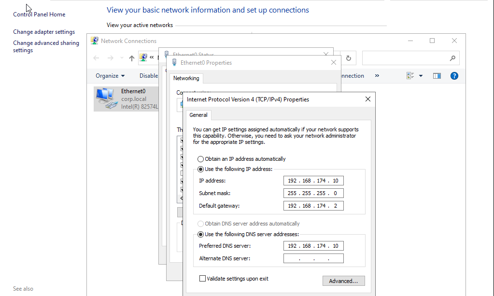

# VMware Network Configuration

## Objective

Configure network communication between the Domain Controller and client workstation.

## Issue

The client workstation was unable to communicate with the Domain Controller, causing domain join attempts to fail.

## Root Cause

The Domain Controller was configured on a different subnet than the VMware NAT network.

## Resolution

- Verified both virtual machines were connected to the VMware NAT network.
- Reconfigured the Domain Controller with the correct static IP address.
- Assigned the Domain Controller the address **192.168.174.10**.
  
  
- Verified network communication using `ping`.
- Confirmed DNS resolution using `nslookup`. 

## Result

- Client successfully communicated with the Domain Controller.
- DNS resolved the `corp.local` domain correctly.
- Domain join completed successfully.
