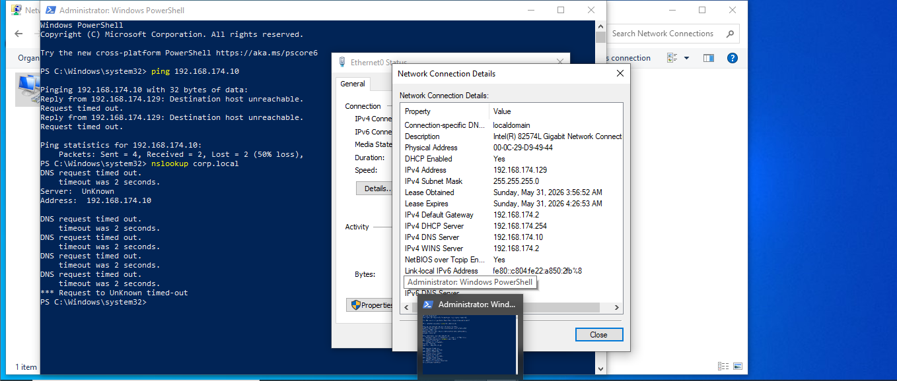

Issue:
Client could not locate Domain Controller.

Symptoms:
DNS timeout errors during domain join.

Investigation:
- Verified network settings
- Checked DNS configuration
- Tested connectivity with ping
- Verified name resolution using nslookup

 

Root Cause:
Subnet mismatch between Domain Controller and VMware NAT network.

Resolution:
Updated Domain Controller static IP configuration to match VMware NAT subnet.

#### Refer to HD-005 Network Connectivity Troubleshooting

Outcome:
Client successfully joined domain.
